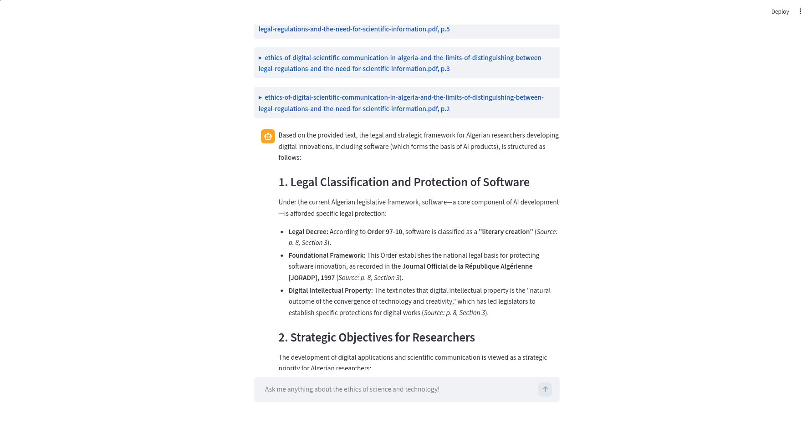
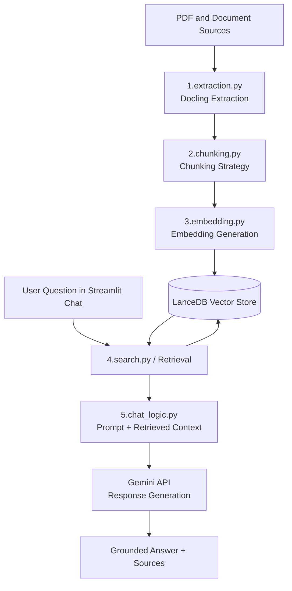

# Knowledge Extraction Pipeline with Docling

This project is an educational journey into document intelligence.
The main idea was simple: explore Docling in a practical way, then build a complete knowledge extraction pipeline that can parse documents, chunk content, embed it, search it semantically, and answer questions through a chat interface.

This project is a Retrieval-Augmented Generation (RAG) system.



## Project Story

We started this project to learn by building.

At first, the chat layer was tested with an OpenAI API key. As the project evolved, we migrated the generation layer to Gemini, and the current implementation uses `GEMINI_API_KEY` for response generation in the legal chatbot workflow.

The result is a pipeline that transforms raw documents into searchable knowledge and then exposes that knowledge through an interactive Streamlit experience.

In other words, it follows the RAG pattern: retrieve relevant chunks first, then generate grounded answers from that retrieved context.

## Educational Purpose

This repository is built for educational purposes.
It demonstrates end-to-end concepts in:

- document parsing and extraction
- semantic chunking strategy
- vector embeddings and retrieval
- retrieval-augmented chat logic
- practical Streamlit application patterns

## Pipeline Overview

The core scripts in `src/` represent each pipeline stage:

- `1.extraction.py`: extract structured content from source documents.
- `2.chunking.py`: split extracted content into retrieval-friendly chunks.
- `3.embedding.py`: generate vectors and store them in LanceDB.
- `4.search.py`: run semantic similarity search.
- `5.chat_logic.py`: combine retrieval context with LLM response generation.

Data is persisted in `src/data/lancedb/`.

## System Design (Mermaid)



## Streamlit Docs and Utilities

In addition to the main pipeline, this repo includes supporting learning material and helpers:

- `src/streamlit_docs/`: hands-on Streamlit notes and examples (state, caching, app behavior, and visuals).
- `utils/`: utility scripts such as sitemap and tokenizer helpers used during experimentation.

These folders reflect the educational nature of the project: not only building the pipeline, but understanding each building block deeply.

## Installation

This project uses Python 3.10.

### Option 1: Conda

```bash
conda create -n document-pipeline python=3.10
conda activate document-pipeline
pip install -r requirements.txt
```

To deactivate:

```bash
conda deactivate
```

### Option 2: Python Virtual Environment (venv)

Create and activate a virtual environment:

```bash
python3.10 -m venv .venv
source .venv/bin/activate
pip install -r requirements.txt
```

To deactivate:

```bash
deactivate
```

## Quick Start

1. Prepare your environment and install dependencies.
2. Run the pipeline stages in order from extraction to embedding.
3. Launch the chat interface and ask questions grounded in your indexed documents.

## Notes

- This project is intended for experimentation and learning.
- Keep API keys in environment variables (for current setup, use `GEMINI_API_KEY`).